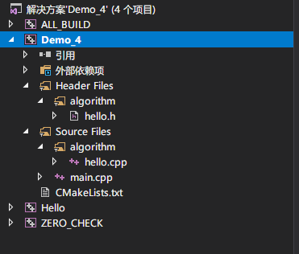

参考资料：

- [CMake入门实战](https://www.hahack.com/codes/cmake)
- [CMake的基本操作(以Windows平台为例)](https://blog.csdn.net/yp18792574062/article/details/106987891)

# 准备

如果软件想跨平台，必须要保证能够在不同平台编译。而如果使用上面的 Make 工具，就得为每一种标准写一次 Makefile

CMake就是针对上面问题所设计的工具：它首先允许开发者编写一种平台无关的CMakeLists.txt来定制整个编程流程，然后再根据目标用户的平台进一步生成所需的本地化Makefile和工程文件。

例如：Unix的Makefile或Windows的Visual Studio工程。

从而做到“Write once, run everywhere”。

本文以Windows为例

下载地址：https://cmake.org/download/

然后将CMake添加到环境变量中(默认路径：`C:Program Files\CMake\bin`)

CMake的所有操作都是在CMakeLists.txt里面完成的，所以主要就是完成CMakeLists.txt文件了

# 单个源文件

## 创建文件

假设现在我们的项目中只有一个源文件 main.cpp

main.cpp的内容如下：

```c++
#include <iostream>
#include <vector>
#include <string>

using namespace std;

int main()
{
    vector<string> msg {"Hello", "CMake"};

    for (const string& word : msg)
    {
        cout << word << " ";
    }
    cout << endl;
}
```

## 创建CMakeLists.txt

创建CMakeLists.txt，并保存在与main.cpp的同级目录下，内容如下：

```shell
# CMake 最低版本要求
cmake_minimum_required(VERSION 3.2)

# 项目信息
project(Demo_1)

# 指定生成目标
add_executable(Demo_1 main.cpp)
```

CMakeLists.txt 的语法比较简单，由命令、注释和空格组成，其中命令是不区分大小写的。符号 # 后面的内容被认为是注释。命令由命令名称、小括号和参数组成，参数之间使用空格进行间隔。

对于上面的 CMakeLists.txt 文件，依次出现了几个命令：

- cmake_minimum_required：指定运行此配置文件所需的 CMake 的最低版本；
- project：参数值是 Demo1，该命令表示项目的名称是 Demo1 。
- add_executable： 将名为 main.cpp 的源文件编译成一个名称为 Demo 的可执行文件。


## 编译

在当前目录下打开windows的命令行工具，键入：

```
cmake -S . -B build
```


|参数| 含义|
|:--: | :--|
|-S | 指定源文件根目录，必须包含一个CMakeLists.txt文件|
|-B | 指定构建目录，构建生成的中间文件和目标文件的生成路径|
|-D | 指定变量，格式为-D <var>=<value>，-D后面的空格可以省略|
 
比如，指明使用当前目录作为源文件目录，其中包含CMakeLists.txt文件；使用build目录作为构建目录；设定变量CMAKE_BUILD_TYPE的值为Debug，变量AUTHOR的值为RealCoolEngineer：

`cmake -S . -B build -DCMAKE_BUILD_TYPE=Debug -DAUTHOR=RealCoolEngineer`

# 多个源文件

## 创建文件

```
./Demo_2
    |
    +--- main.cpp
    |
    +--- hello.cpp
    |
    +--- hello.h
```

hello.h代码如下：
```c++
#pragma once

void test(const std::vector<std::string>& str);
```

hello.cpp代码如下：
```c++
#include <iostream>
#include <vector>
#include <string>
#include "hello.h"

using namespace std;

void test(const vector<string>& msg){
    for (const string& word : msg)
    {
        cout << word << " ";
    }
    cout << endl;
    return;
}
```

main.cpp代码如下：

```c++
#include <iostream>
#include <vector>
#include <string>
#include "hello.h"

using namespace std;

void test(const vector<string>& msg){
    for (const string& word : msg)
    {
        cout << word << " ";
    }
    cout << endl;
    return;
}
```

## 创建CMakeLists

```shell
# CMake 最低版本号要求
cmake_minimum_required (VERSION 3.2)

# 项目信息
project (Demo_2)

# 查找当前目录下的所有源文件
# 并将名称保存到 DIR_SRCS 变量
aux_source_directory(. DIR_SRCS)

# 指定生成目标
add_executable(Demo_2 ${DIR_SRCS})
```

使用 aux_source_directory 命令，该命令会查找指定目录下的所有源文件，然后将结果存进指定变量名。其语法如下：

这样，CMake 会将当前目录所有源文件的文件名赋值给变量 DIR_SRCS ，再指示变量 DIR_SRCS 中的源文件需要编译成一个名称为 Demo_2 的可执行文件。

`aux_source_directory(<dir> <variable>)`

## 编译

在当前目录下打开windows的命令行工具，键入：

```
cmake -S . -B build
```

# 多个目录，多个源文件

## 创建文件

```
./Demo_3
    |
    +--- main.cpp
    |
    +--- algorithm/
          |
          +--- hello.cpp
          |
          +--- hello.h
```

## 创建CMakeLists

对于这种情况，需要分别在项目根目录 Demo_3 和 algorithm 目录里各编写一个 CMakeLists.txt 文件。

为了方便，我们可以先将 algorithm 目录里的文件编译成静态库，由 main 函数调用。

（编译时，只需在根目录下执行一次cmake即可）

根目录中的 CMakeLists.txt ：

```shell
# CMake 最低版本号要求
cmake_minimum_required (VERSION 3.2)

# 项目信息
project (Demo_3)

# 查找当前目录下的所有源文件
# 并将名称保存到 DIR_SRCS 变量
aux_source_directory(. DIR_SRCS)

# 添加 math 子目录
add_subdirectory(algorithm)

# 指定生成目标 
add_executable(Demo_3 main.cpp)

# 添加链接库
target_link_libraries(Demo_3 Hello)
```

使用命令 add_subdirectory 指明本项目包含一个子目录 algorithm，这样 algorithm 目录下的 CMakeLists.txt 文件和源代码也会被处理。

使用命令 target_link_libraries 指明可执行文件 main 需要连接一个名为 Hello 的链接库 。

子目录下的 CMakeLists.txt ：

```shell
# 查找当前目录下的所有源文件
# 并将名称保存到 DIR_LIB_SRCS 变量
aux_source_directory(. DIR_LIB_SRCS)

# 生成链接库
add_library (Hello ${DIR_LIB_SRCS})
```

使用命令 add_library 将目录中的源文件编译为静态链接库。

# 在 CMake 生成的 Visual Studio 工程中保持源码文件的目录组织

## source_group介绍

在某一工程内，多个文件散乱的分布在 Source Files/ 目录和 Header Files 目录中, 不便于查看和调试代码，

通过使用 source_group 命令, 可以使源码保持原本的目录组织方式 (当然也可以自己重新组织).

先看看官方给出的命令说明: source_group() 用于定义生成 IDE 工程时的源码分组 (source groups). 有两种创建方式:

- source_group(<name> [FILES <src>...] [REGULAR_EXPRESSION <regex>])
- source_group(TREE <root> [PREFIX <prefix>] [FILES <src>...])

于定义工程中的源码属于哪个目录组, 主要用于 Visual Studio 中. 有以下选项:

- TREE CMake 会自动检测 <src> 文件路径来确定需要创建的 source groups, 使得工程中的目录结构和实际文件在磁盘上的目录结构一致. 根据 <root> 指定的根路径将 <src> 中的路径截断为相对路径;
- PREFIX 在 <root> 路径中的 Source group 和文件会被放在 <prefix> group 中;
- FILES 将显式指定的所有源文件都放在 <name> group 中, 如果是相对路径, 则是以当前源码路径为参考;
- REGULAR_EXPRESSION 可以匹配到正则表达式的源码文件会被放在 <name> group 中. 如果某个源码文件可以和多个组进行匹配, 则该文件会被归到最后一个组; 如果某个源码文件没有和任一个组匹配上, 则该文件会被归到正则表达式的最后一个组.

## 创建文件

```
./Demo_4
    |
    +--- src/
    |     |
    |     +--- main.cpp
    |
    +--- algorithm/
          |
          +--- hello.cpp
          |
          +--- hello.h
```

## 创建CMakeLists.txt

分别在项目根目录 Demo_4 和 algorithm 目录里各编写一个 CMakeLists.txt 文件。

algorithm的CMakeLists.txt文件与前一节的相同，均是将目录中的源文件编译为静态链接库。

根目录中的 CMakeLists.txt ：

```shell
# CMake 最低版本号要求
cmake_minimum_required (VERSION 3.2)

# 项目信息
project (Demo_4)

# 添加 algorithm 子目录
add_subdirectory(algorithm)

#main
set(PROJECT_MAIN_DIR "${CMAKE_CURRENT_SOURCE_DIR}/src")
file(GLOB project_main_source_files ${PROJECT_MAIN_DIR}/*.cpp)
source_group("Source Files" FILES ${project_main_source_files})

#algorithm
set(PROJECT_ALGORITHM_DIR "${PROJECT_MAIN_DIR}/algorithm")
file(GLOB project_algorithm_header_files ${PROJECT_ALGORITHM_DIR}/*.h)
file(GLOB project_algorithm_source_files ${PROJECT_ALGORITHM_DIR}/*.cpp)
source_group("Header Files\\algorithm" FILES ${project_algorithm_header_files})
source_group("Source Files\\algorithm" FILES ${project_algorithm_source_files})


#将上述文件夹include到工程里面
include_directories(${PROJECT_MAIN_DIR} ${PROJECT_ALGORITHM_DIR})


# 指定生成目标
add_executable(${PROJECT_NAME} ${project_main_source_files} ${project_algorithm_header_files} ${project_algorithm_source_files})

# 添加链接库
target_link_libraries(${PROJECT_NAME} Hello)
```

## 编译

在当前目录下打开windows的命令行工具，键入：

```
cmake -S . -B build
```

结果截图如下：




